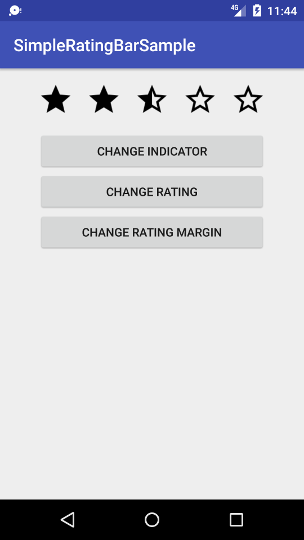

# SimpleRatingBar

[](https://jitpack.io/#borjabravo10/SimpleRatingBar)

SimpleRatingBar allows us to create a RatingBar with margin between items

## Download
To add the SimpleRatingBar library to your Android Studio project, simply add the following gradle dependency:
```java
compile 'com.borjabravo:simpleratingbar:1.0.0'
```

## Usage

To use the SimpleRatingBar on your app, add the following code to your layout:

```xml
<com.borjabravo.simpleratingbar.SimpleRatingBar
    android:id="@+id/simple_rating_bar"
    android:layout_width="wrap_content"
    android:layout_height="wrap_content"
    app:isIndicator="false"
    app:ratingCount="5"
    app:ratingMargin="15dp"
    app:ratingSize="42dp"/>
```    


License
=======

    Copyright 2017 Borja Bravo Álvarez

    Licensed under the Apache License, Version 2.0 (the "License");
    you may not use this file except in compliance with the License.
    You may obtain a copy of the License at

       http://www.apache.org/licenses/LICENSE-2.0

    Unless required by applicable law or agreed to in writing, software
    distributed under the License is distributed on an "AS IS" BASIS,
    WITHOUT WARRANTIES OR CONDITIONS OF ANY KIND, either express or implied.
    See the License for the specific language governing permissions and
    limitations under the License.
